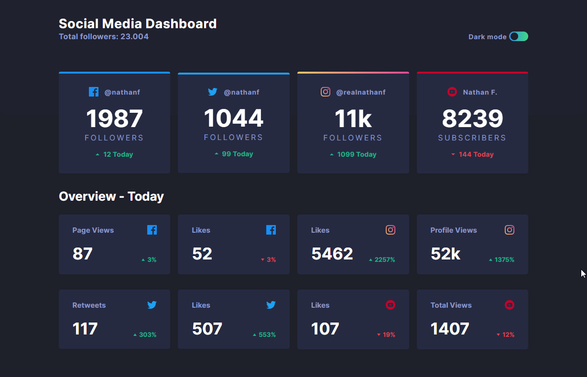
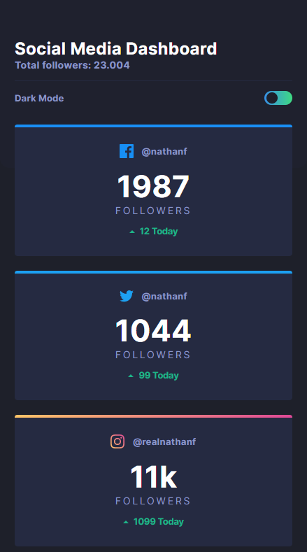
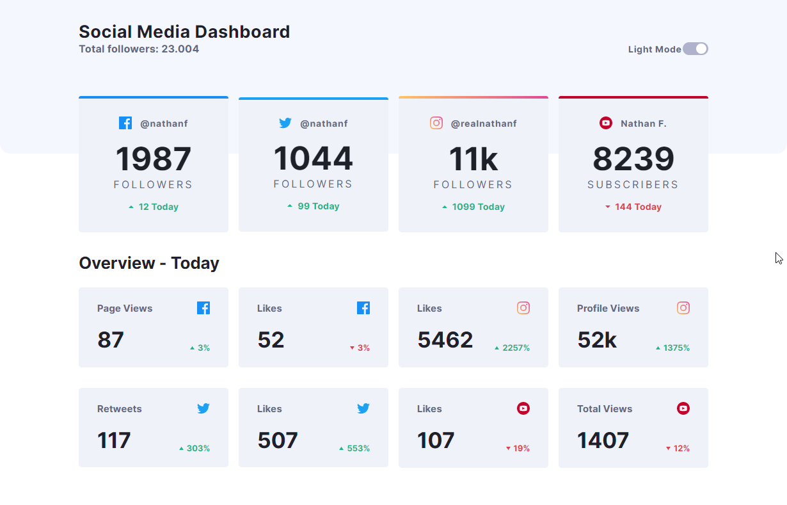
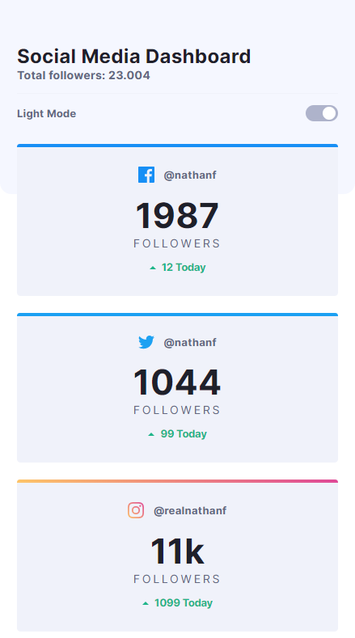

# social-media-dashboard-with-theme
It's a mockup of a Social media dashboard with theme changer.

# Technologies
In this project I used HTML, SCSS(SASS), JS.

[This is a challenge of FrontEnd Mentor](https://www.frontendmentor.io/challenges/social-media-dashboard-with-theme-switcher-6oY8ozp_H).

## Result

> ### See the result live [here](https://social-media-dashboard-with-theme.vercel.app/)

Desktop - Dark Theme

Mobile - Dark Theme

Desktop - Light Theme

Mobile - Light Theme

